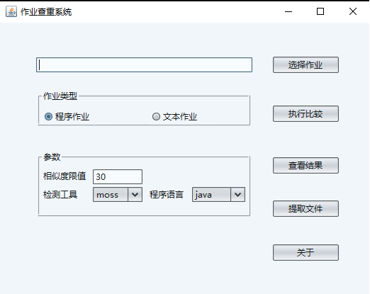

# antiplag 程序代码及文档作业相似度检查软件
“作业相似度比较系统”软件主要检查、比较学生提交的电子档作业之间的相似度，能对程序语言（如java、c、c#等）类作业、中英文文档类作业（如实验报告等）之间的相似度进行比较，进而辅助发现学生之间互相抄袭的行为。

## 需求
jdk1.6及以上版本

## 安装
直接下载或clone该项目，在项目的deploy子目录下，是软件的发布版。
源代码版可以直接导入eclipse，主入口类是gui.plag.edu下的PlagGUI。

## 使用
使用说明参见deploy子目录下的软件使用文档。程序主界面如下：
 
  
## 原理
系统采用的主要技术是自然语言处理（nlp）中的文本相似度计算。程序类文本的相似度比较基于两个开放系统：
* 一个是基于网络服务的[MOSS系统](http://theory.stanford.edu/~aiken/moss/)（斯坦福大学开放的支持十几种编程语言代码相似度比较的系统）;
* 另一个是本地执行的[sim系统](https://dickgrune.com/Programs/similarity_tester/)（支持java、c等语言的文本相似度比较）。

本系统在它们基础上进行了二次开发和封装，针对moss系统，开发出了客户端存取模块，实现了代码文件提交、结果获取和解析、结果排序等功能；针对sim，则将其集成到系统中，在moss因网络故障等原因不可用时，可作为替代产品使用。

中英文文档作业相似度的比较则基于[shinglecloud算法](https://www.kom.tu-darmstadt.de/de/research-results/0/1/shinglecloud/)（一种基于文本指纹的、语言无关的相似度快速计算方法），文档主要处理过程如下：
* 1 使用tika读取不同格式（txt、doc、docx等）的文档，并将其转换成能统一处理的文本；
* 2 使用ikanalyzer对文本进行预处理、精确分词：如去掉标点符号等；
* 3 使用shinglecloud算法计算文本之间的相似度；
* 4 根据相似度排序，输出比较结果。

源于开源，还于开源，开源是美德，加星也是美德 :smile: 。

 